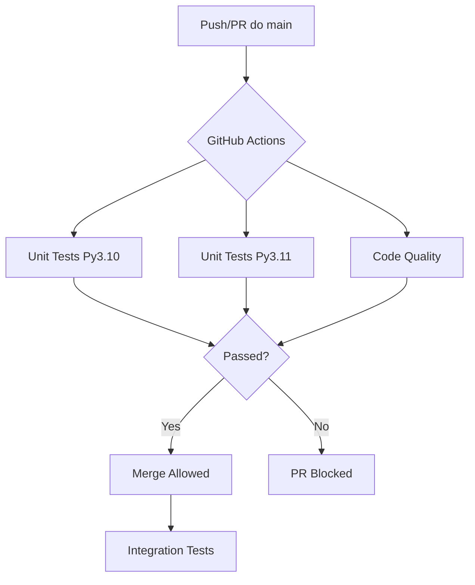

# ✅ Podsumowanie: System CI/CD dla Live 2.0

## 🎯 Co zostało zrobione

System automatycznych testów został w pełni skonfigurowany i jest gotowy do użycia!

### Utworzone Pliki

#### 1. **GitHub Actions Workflow**
- `.github/workflows/ci-tests.yml` - główny workflow CI/CD
  - ✅ 3 joby: unit tests, integration tests, code quality
  - ✅ Matrix testing (Python 3.10 i 3.11)
  - ✅ Automatyczne triggery na push i PR do main
  - ✅ Używa `requirements-ci.txt` (lżejsza wersja bez RDKit)

#### 2. **Dokumentacja**
- `.github/workflows/README.md` - dokumentacja workflow
- `docs/CI_CD_GUIDE.md` - kompletny przewodnik (35+ stron)
- `.github/CI_CHEATSHEET.md` - szybki cheatsheet

#### 3. **Skrypty Pomocnicze**
- `.github/scripts/run_local_ci.sh` - testy lokalne (Linux/Mac)
- `.github/scripts/run_local_ci.ps1` - testy lokalne (Windows)

#### 4. **Dependencies**
- `requirements-ci.txt` - zoptymalizowane zależności dla CI

#### 5. **Przykłady**
- `tests/test_example_template.py` - template testów z przykładami

#### 6. **README**
- Zaktualizowany `README.md` z badge statusu CI

---

## 🚀 Jak to działa

### Automatyczne Uruchomienie



### 3 Główne Joby

| Job | Trigger | Czas | Co sprawdza |
|-----|---------|------|-------------|
| **test** | PR + push main | ~15 min | Unit tests (bez slow) |
| **integration-tests** | tylko push main | ~45 min | Pełne testy integracyjne |
| **code-quality** | PR + push main | ~5 min | Black, isort, mypy |

---

## 📋 Jak używać - Quick Start

### 1. Normalna praca z kodem

```bash
# 1. Utwórz branch
git checkout -b feature/moja-zmiana

# 2. Edytuj kod
# ... wprowadź zmiany ...

# 3. Testuj lokalnie (WAŻNE!)
bash .github/scripts/run_local_ci.sh

# 4. Commit i push
git add .
git commit -m "feat: dodaj nową funkcję"
git push origin feature/moja-zmiana

# 5. Otwórz Pull Request
# Testy uruchomią się automatycznie!

# 6. Sprawdź status w PR
# ✅ = możesz merge
# ❌ = coś nie działa, sprawdź logi

# 7. Po przejściu testów - merge
```

### 2. Lokalne testowanie (przed push)

#### Windows:
```powershell
.\.github\scripts\run_local_ci.ps1
```

#### Linux/Mac:
```bash
bash .github/scripts/run_local_ci.sh
```

### 3. Szybkie poprawki formatowania

```bash
# Automatyczne naprawienie
black backend/ scripts/ matcher/
isort backend/ scripts/ matcher/

# Commit
git add .
git commit -m "style: fix code formatting"
```

---

## 🎯 Co CI sprawdza

### ✅ Unit Tests
- Wszystkie testy w `backend/tests/`
- Wszystkie testy w `tests/` (bez slow i stability)
- Timeout: 30 minut
- Na 2 wersjach Pythona (3.10, 3.11)

### ✅ Integration Tests
- Testy oznaczone `@pytest.mark.integration`
- Uruchamiane tylko po merge do main
- Timeout: 60 minut

### ✅ Code Quality
- **Black** - formatowanie kodu
- **isort** - sortowanie importów
- **mypy** - type checking (ostrzeżenia, nie blokuje)

---

## 📊 Status Badge

W README.md pojawił się badge pokazujący status testów:


- 🟢 **passing** - wszystko OK
- 🔴 **failing** - coś nie działa
- 🟡 **pending** - testy w trakcie

---

## 🔧 Konfiguracja Specjalna dla Live 2.0

### Taichi w CPU Mode
Taichi jest automatycznie inicjalizowany w trybie CPU przez `conftest.py`:
```python
ti.init(arch=ti.cpu, debug=False, cpu_max_num_threads=1)
```

### Lżejsze Dependencies
CI używa `requirements-ci.txt` zamiast `requirements.txt`:
- ✅ Szybsza instalacja
- ✅ Bez problematycznego RDKit
- ✅ Wszystkie niezbędne pakiety testowe

### Pominięte Testy
Automatycznie pomijane w CI:
- `@pytest.mark.slow` - długie testy
- `test_stability_24h.py` - testy 24-godzinne
- Testy z "stability" w nazwie

---

## 📚 Dokumentacja

### Dla Szybkich:
- `.github/CI_CHEATSHEET.md` - 2 minuty czytania

### Dla Dociekliwych:
- `docs/CI_CD_GUIDE.md` - pełny przewodnik
- `.github/workflows/README.md` - szczegóły workflow

### Dla Piszących Testy:
- `tests/test_example_template.py` - przykłady wszystkich typów testów

---

## 🐛 Najczęstsze Problemy i Rozwiązania

### Problem: Test fails in CI but not locally

**Rozwiązanie:**
```bash
# Taichi automatycznie w CPU mode przez conftest.py
pytest tests/ -v -m "not slow"
```

### Problem: Black/isort failures

**Rozwiązanie:**
```bash
black backend/ scripts/ matcher/
isort backend/ scripts/ matcher/
```

### Problem: Import errors

**Rozwiązanie:**
```bash
export PYTHONPATH=$(pwd)/backend  # dla backend tests
export PYTHONPATH=$(pwd)          # dla root tests
```

---

## 🎓 Best Practices

### ✅ Zawsze testuj lokalnie przed push
```bash
bash .github/scripts/run_local_ci.sh
```

### ✅ Używaj conventional commits
```
feat:     Nowa funkcjonalność
fix:      Naprawa błędu
docs:     Dokumentacja
style:    Formatowanie
test:     Testy
refactor: Refactoring
```

### ✅ Pisz testy dla nowego kodu
```python
# Dobra praktyka: test przed implementacją (TDD)
def test_new_feature():
    result = my_new_function()
    assert result == expected
```

### ✅ Używaj markerów
```python
@pytest.mark.unit           # Szybki test jednostkowy
@pytest.mark.integration    # Test integracyjny
@pytest.mark.slow           # Długi test (pominięty w CI)
```

---

## 🔮 Co dalej?

### Opcjonalne Ulepszenia

1. **Branch Protection Rules**
   - Wymuszenie przejścia testów przed merge
   - Settings → Branches → Add rule

2. **Code Coverage**
   ```bash
   pip install pytest-cov
   pytest --cov=backend/sim --cov-report=html
   ```

3. **Pre-commit Hooks**
   - Auto-formatowanie przed commitem
   - Zobacz `.github/CI_CHEATSHEET.md`

4. **Performance Benchmarks**
   - Tracking wydajności w czasie
   - Dodać job do workflow

5. **Deployment**
   - Auto-deploy po przejściu testów
   - Dodać deploy job do workflow

---

## 📞 Pomoc i Wsparcie

### Sprawdź logi
```
GitHub → Actions → wybierz run → sprawdź failed jobs
```

### Lokalna diagnoza
```bash
pytest --lf -v --tb=long  # Uruchom tylko failed tests z verbose
```

### Dokumentacja
- Pełny guide: `docs/CI_CD_GUIDE.md`
- Cheatsheet: `.github/CI_CHEATSHEET.md`
- Template testów: `tests/test_example_template.py`

---

## ✨ Podsumowanie

### Co masz teraz:

✅ **Automatyczne testy** po każdym push do main  
✅ **Ochrona przed bugami** - wykrywanie błędów przed merge  
✅ **Code quality checks** - spójny styl kodu  
✅ **Badge w README** - widoczny status projektu  
✅ **Lokalne narzędzia** - test przed push  
✅ **Pełna dokumentacja** - wszystko opisane  
✅ **Przykłady** - template dla nowych testów  

### Następny krok:

1. **Commit i push te pliki**
2. **Otwórz PR** i zobacz CI w akcji!
3. **Po merge** - badge w README będzie aktywny

```bash
git add .
git commit -m "feat: add CI/CD with GitHub Actions"
git push origin main
```

---

**System jest gotowy do użycia! 🚀**

**Pytania?** Sprawdź `docs/CI_CD_GUIDE.md` lub `.github/CI_CHEATSHEET.md`

**Ostatnia aktualizacja:** 2025-11-16  
**Status:** ✅ Gotowe do produkcji

