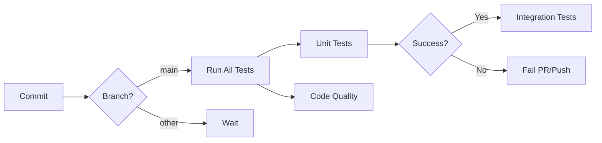

# CI/CD Guide - Automatyczne Testy w Live 2.0

## 📚 Spis Treści

1. [Wprowadzenie](#wprowadzenie)
2. [Jak to działa](#jak-to-działa)
3. [Konfiguracja](#konfiguracja)
4. [Używanie systemu](#używanie-systemu)
5. [Lokalne testowanie](#lokalne-testowanie)
6. [Troubleshooting](#troubleshooting)
7. [Best Practices](#best-practices)

---

## Wprowadzenie

System CI/CD (Continuous Integration/Continuous Deployment) automatycznie uruchamia testy przy każdym merge do brancha `main`. Dzięki temu:

- ✅ **Wykrywamy błędy wcześnie** - zanim trafią do produkcji
- ✅ **Zapewniamy jakość kodu** - automatyczne sprawdzanie formatowania i typów
- ✅ **Oszczędzamy czas** - testy działają równolegle w chmurze
- ✅ **Dokumentujemy status** - badge w README pokazuje czy testy przechodzą

## Jak to działa

### Workflow GitHub Actions

Plik `.github/workflows/ci-tests.yml` definiuje 3 główne joby:

#### 1. **test** (Python 3.10 i 3.11)
```yaml
Trigery: Push i PR do main
Czas: ~10-15 minut
Akcje:
  ✓ Instalacja zależności
  ✓ Konfiguracja Taichi (CPU mode)
  ✓ Testy jednostkowe (backend)
  ✓ Testy główne (bez długich testów stabilności)
```

#### 2. **integration-tests** (tylko po merge)
```yaml
Trigger: Tylko push do main (nie PR)
Czas: ~30-45 minut
Akcje:
  ✓ Pełne testy integracyjne
  ✓ Testy z markerem "integration"
```

#### 3. **code-quality**
```yaml
Trigger: Push i PR do main
Czas: ~3-5 minut
Akcje:
  ✓ Black (formatowanie)
  ✓ isort (sortowanie importów)
  ✓ mypy (type checking - ostrzeżenia)
```

### Automatyczne Triggery



## Konfiguracja

### 1. Włączenie GitHub Actions

GitHub Actions powinno być włączone domyślnie. Sprawdź w:
```
Settings → Actions → General → Allow all actions
```

### 2. Branch Protection (Opcjonalne ale Zalecane)

Aby wymagać przejścia testów przed merge:

1. Przejdź do: **Settings → Branches → Add rule**
2. Branch name pattern: `main`
3. Zaznacz:
   - ✅ Require status checks to pass before merging
   - ✅ Require branches to be up to date before merging
   - ✅ Status checks that are required:
     - `test (3.10)`
     - `test (3.11)`
     - `code-quality`

### 3. Zależności

Projekt używa dwóch plików requirements:

- **`requirements.txt`** - Pełne zależności (z RDKit)
- **`requirements-ci.txt`** - Lżejsza wersja dla CI (bez RDKit)

CI automatycznie wybiera `requirements-ci.txt` jeśli istnieje.

## Używanie systemu

### Normalny Workflow

1. **Utwórz branch dla feature:**
```bash
git checkout -b feature/moja-zmiana
```

2. **Wprowadź zmiany i commit:**
```bash
git add .
git commit -m "feat: dodaj nową funkcję"
```

3. **Push i utwórz PR:**
```bash
git push origin feature/moja-zmiana
```

4. **Otwórz Pull Request na GitHub**
   - Testy uruchomią się automatycznie
   - Sprawdź wyniki w zakładce "Checks"

5. **Po przejściu testów - merge do main**
   - Po merge uruchomią się testy integracyjne

### Sprawdzanie Statusu Testów

#### W Pull Request:
- Na dole PR zobaczysz status checks
- ✅ Zielony check = testy przeszły
- ❌ Czerwony X = testy failują
- 🟡 Żółty = testy w trakcie

#### W Actions Tab:
```
GitHub → Actions → All workflows
```
Tutaj zobaczysz:
- Historie wszystkich uruchomień
- Logi z każdego kroku
- Czas wykonania
- Artefakty (logi testów)

### Badge Statusu

Badge w README pokazuje aktualny status:


- 🟢 **passing** - wszystkie testy OK
- 🔴 **failing** - jakieś testy failują
- 🔵 **no status** - brak ostatnich uruchomień

## Lokalne Testowanie

**WAŻNE:** Zawsze testuj lokalnie przed pushem!

### Metoda 1: Skrypt Automatyczny (Zalecane)

#### Linux/Mac:
```bash
bash .github/scripts/run_local_ci.sh
```

#### Windows PowerShell:
```powershell
.\.github\scripts\run_local_ci.ps1
```

Ten skrypt uruchomi **dokładnie te same testy** co CI.

### Metoda 2: Manualne Komendy

#### Ustaw środowisko:
```bash
export TI_ARCH=cpu
export PYTHONPATH=$(pwd)
```

#### Testy backend:
```bash
cd backend
pytest tests/ -v -m "not slow" --tb=short --color=yes
cd ..
```

#### Testy root:
```bash
pytest tests/ -v -k "not stability and not 24h" --tb=short --color=yes
```

#### Code quality:
```bash
black --check backend/ scripts/ matcher/
isort --check-only backend/ scripts/ matcher/
mypy backend/sim/ --ignore-missing-imports
```

#### Auto-fix formatowania:
```bash
black backend/ scripts/ matcher/
isort backend/ scripts/ matcher/
```

### Metoda 3: Pojedyncze Testy

```bash
# Uruchom konkretny test
pytest tests/test_config.py -v

# Uruchom testy z konkretnego folderu
pytest backend/tests/ -v

# Uruchom z markerem
pytest -v -m "unit"
pytest -v -m "integration"
pytest -v -m "slow"

# Uruchom z matchowaniem nazwy
pytest -v -k "test_particle"
```

## Troubleshooting

### ❌ Problem: Testy failują w CI ale nie lokalnie

**Powód:** Różnice w środowisku (OS, zależności, Taichi mode)

**Rozwiązanie:**
```bash
# Sprawdź czy używasz CPU mode
export TI_ARCH=cpu

# Reinstaluj zależności
pip install --force-reinstall -r requirements.txt

# Uruchom z dokładnie tymi samymi flagami co CI
pytest tests/ -v -m "not slow" --tb=short --color=yes
```

### ❌ Problem: Testy failują lokalnie ale nie w CI

**Powód:** Lokalnie mogą być stare pliki cache, inne wersje pakietów

**Rozwiązanie:**
```bash
# Wyczyść cache
find . -type d -name "__pycache__" -exec rm -r {} +
find . -type f -name "*.pyc" -delete

# Reinstaluj w świeżym venv
python -m venv fresh_env
source fresh_env/bin/activate  # lub fresh_env\Scripts\activate na Windows
pip install -r requirements.txt
```

### ❌ Problem: RDKit installation failed

**Powód:** RDKit jest duży i może mieć problemy na niektórych systemach

**Rozwiązanie:**
```bash
# CI używa requirements-ci.txt bez RDKit
pip install -r requirements-ci.txt

# Lub zainstaluj RDKit osobno
pip install rdkit
```

### ❌ Problem: Timeout w testach

**Powód:** Niektóre testy mogą być długie

**Rozwiązanie:**
```bash
# Pomiń slow testy
pytest -v -m "not slow"

# Lub zwiększ timeout w pytest.ini
timeout = 300
```

### ❌ Problem: Black/isort failures

**Powód:** Formatowanie kodu nie jest zgodne

**Rozwiązanie:**
```bash
# Auto-fix wszystkiego
black backend/ scripts/ matcher/
isort backend/ scripts/ matcher/

# Commit
git add .
git commit -m "style: fix code formatting"
```

### ❌ Problem: Cannot find module 'sim'

**Powód:** PYTHONPATH nie jest ustawiony

**Rozwiązanie:**
```bash
# Dla testów backend
export PYTHONPATH=$(pwd)/backend

# Dla testów root
export PYTHONPATH=$(pwd)

# Lub użyj editable install
pip install -e ./backend
```

## Best Practices

### ✅ Przed Każdym Commit

```bash
# 1. Uruchom lokalne testy
bash .github/scripts/run_local_ci.sh

# 2. Fix formatting
black backend/ scripts/ matcher/
isort backend/ scripts/ matcher/

# 3. Commit
git add .
git commit -m "type: description"
```

### ✅ Typy Commitów (Conventional Commits)

```
feat:     Nowa funkcjonalność
fix:      Naprawa błędu
docs:     Zmiany w dokumentacji
style:    Formatowanie (bez zmian w logice)
refactor: Refactoring kodu
test:     Dodanie/modyfikacja testów
chore:    Zmiany w build/narzędziach
perf:     Optymalizacje wydajności
```

### ✅ Writing Good Tests

```python
import pytest

# Używaj opisowych nazw
def test_particle_collision_updates_velocity():
    pass

# Używaj markerów
@pytest.mark.slow
def test_long_running_simulation():
    pass

@pytest.mark.integration
def test_full_simulation_pipeline():
    pass

# Używaj fixtures
@pytest.fixture
def config():
    return SimulationConfig()

def test_with_fixture(config):
    assert config.dt > 0
```

### ✅ Organizacja Testów

```
tests/
├── test_core.py          # Podstawowe testy jednostkowe
├── test_integration.py   # Testy integracyjne (marked)
├── test_performance.py   # Testy wydajności (marked slow)
└── benchmarks/
    ├── test_formose.py   # Benchmarki chemiczne
    └── conftest.py       # Współdzielone fixtures
```

### ✅ Debugging Failed CI

1. **Sprawdź logi w Actions tab**
2. **Pobierz artefakty** (jeśli dostępne)
3. **Odtwórz lokalnie**:
```bash
export TI_ARCH=cpu
pytest -v --tb=long --capture=no
```
4. **Fix i push**

### ✅ Skip Tests Temporarily

```python
# Skip with reason
@pytest.mark.skip(reason="WIP - not implemented yet")
def test_future_feature():
    pass

# Skip conditionally
@pytest.mark.skipif(sys.platform == "win32", reason="Unix only")
def test_unix_specific():
    pass
```

### ✅ Parallel Testing (Local Speedup)

```bash
# Zainstaluj plugin
pip install pytest-xdist

# Uruchom równolegle
pytest -n auto
pytest -n 4  # 4 procesory
```

## Zaawansowane: Customizacja Workflow

### Dodanie Nowego Job

Edytuj `.github/workflows/ci-tests.yml`:

```yaml
  performance-tests:
    runs-on: ubuntu-latest
    if: github.event_name == 'push' && github.ref == 'refs/heads/main'
    
    steps:
    - uses: actions/checkout@v4
    - name: Run performance benchmarks
      run: pytest tests/benchmarks/ -v
```

### Dodanie Secrets

Dla API keys, credentials itp:

1. **GitHub → Settings → Secrets → Actions → New secret**
2. W workflow:
```yaml
env:
  API_KEY: ${{ secrets.MY_API_KEY }}
```

### Matrix Strategy

Testuj na wielu wersjach/platformach:

```yaml
strategy:
  matrix:
    os: [ubuntu-latest, macos-latest, windows-latest]
    python-version: ["3.9", "3.10", "3.11"]
```

## Monitoring i Metrics

### Success Rate

GitHub pokazuje statystyki w:
```
Actions → All workflows → CI Tests → View all runs
```

### Przydatne Metrics:
- ⏱️ Średni czas wykonania
- ✅ Success rate (%)
- 📊 Trends (czy testy stają się wolniejsze?)
- 🔴 Failing tests history

## Przydatne Linki

- [GitHub Actions Docs](https://docs.github.com/en/actions)
- [pytest Documentation](https://docs.pytest.org/)
- [Taichi CI/CD Guide](https://docs.taichi-lang.org/docs/hello_world#cpu-and-gpu)
- [Conventional Commits](https://www.conventionalcommits.org/)

---

**Pytania?** Sprawdź `.github/workflows/README.md` lub otwórz issue na GitHubie.

**Ostatnia aktualizacja:** 2025-11-16

